# UniConnect

UniConnect is a comprehensive application for connecting university students. This guide provides detailed steps to set up and run the application, generate mock data, and import it into a Neo4j database.

## Prerequisites

1. Docker
2. Python
3. Java JDK 17
4. Flutter SDK
5. Maven
6. Android Studio Community (for front-end)
7. IntelliJ IDEA Community (for back-end)

## Table of Contents

1. [Install and Run Neo4j Docker Container](#1-install-and-run-neo4j-docker-container)
2. [Generate Mock Data](#2-generate-mock-data)
3. [Copy CSV File to Docker Container](#3-copy-csv-file-to-docker-container)
4. [Import Data into Neo4j](#4-import-data-into-neo4j)
5. [Set Up the Application](#5-set-up-the-application)
    - [Install Java JDK 17](#install-java-jdk-17)
    - [Install Flutter SDK](#install-flutter-sdk)
    - [Backend Setup (Maven)](#backend-setup-maven)
    - [Frontend Setup (Flutter)](#frontend-setup-flutter)
    - [Install Android Studio Community](#install-android-studio-community)
    - [Install IntelliJ IDEA Community](#install-intellij-idea-community)
6. [Run the Application](#6-run-the-application)
7. [Systems](#systems)
    - [Actors](#actors-)
    - [Pages](#pages-)
    - [Features](#features-)

## 1. Install and Run Neo4j Docker Container

First, install and run the Neo4j Docker container with the following command:

```sh
docker run --name UniConnect-Db-App --publish=7474:7474 --publish=7687:7687 -e 'NEO4J_AUTH=neo4j/uniconnect' neo4j:5
```

### Explanation of Parameters

- `--name UniConnect-Db-App`: Names the Docker container "UniConnect-Db-App".
- `--publish=7474:7474`: Maps port 7474 on your local machine to port 7474 on the Docker container for the Neo4j browser interface.
- `--publish=7687:7687`: Maps port 7687 on your local machine to port 7687 on the Docker container for the Bolt protocol.
- `-e 'NEO4J_AUTH=neo4j/uniconnect'`: Sets the Neo4j authentication with the username `neo4j` and the password `uniconnect`.
- `neo4j:5`: Specifies the version of the Neo4j Docker image to use.

## 2. Generate Mock Data

Create a Python script to generate mock student data and save it to a CSV file.

**Python Script to Generate Mock Data (`generate_mock_data.py`):**

```python
import bcrypt
import pandas as pd
from faker import Faker
import uuid

# Configure the salt for bcrypt
salt = b"$2a$10$Gs.PmaGJQtm0ThQF3VkX2u"

def hash_password(password):
    hashed_password = bcrypt.hashpw(password.encode('utf-8'), salt)
    return hashed_password.decode('utf-8')

# Create an instance of Faker
fake = Faker()

# Number of students to generate
num_students = 600

# Enums for the department
departments = [
    "AGRICOLA", "ARCHITETTURA", "BIOMEDICHE", "FORMAZIONE_BENICULTURALI", 
    "CHIMICHE", "ECONOMICHE_STATISTICHE", "GIURIDICHE", "INGEGNERIA_ELETTRICA", 
    "INGEGNERIA_EDILE", "INGEGNERIA_INDUSTRIALE", "INFORMATICA", "MATEMATICA_FISICA", 
    "MEDICINA_CHIRURGIA_ODONTOIATRIA", "FARMACIA", "MOTORIE_UMANE_SOCIALI", 
    "POLITICHE_SOCIALI", "LINGUAGGIO_BENICULTURALI", "FISICA", "SCUOLA_MEDICINA"
]

# Mock data
data = []
for _ in range(num_students):
    student_id = str(uuid.uuid4())
    full_name = fake.name()
    name_parts = full_name.split()
    first_name = name_parts[0].lower()
    last_name = name_parts[-1].lower()
    email = f"{first_name}.{last_name}@gmail.com"
    password_hash = hash_password("Ciao1002!")
    biography = " "
    departement_unisa = fake.random_element(departments)
    data.append([student_id, full_name, email, password_hash, departement_unisa,biography])

# Create a DataFrame and save to a CSV
df = pd.DataFrame(data, columns=["ID", "fullName", "email", "passwordHash", "departementUnisa"."biography"])
df.to_csv("mock_students.csv", index=False)
```

### Run the Script to Generate the CSV File

Run the Python script to generate the `mock_students.csv` file.

```sh
python generate_mock_data.py
```

## 3. Copy CSV File to Docker Container

Copy the `mock_students.csv` file into the `/var/lib/neo4j/import` folder of the Docker container.

```sh
docker cp mock_students.csv UniConnect-Db-App:/var/lib/neo4j/import/
```

## 4. Import Data into Neo4j

Access the Cypher Shell of the Neo4j Docker container.

```sh
docker exec -it UniConnect-Db-App bin/cypher-shell -u neo4j -p uniconnect
```

Run the following command in the Cypher Shell to import the data from the CSV file into the Neo4j database.

```cypher
LOAD CSV WITH HEADERS FROM 'file:///mock_students.csv' AS row
CREATE (:Student {ID: row.ID, fullName: row.fullName, email: row.email, passwordHash: row.passwordHash, departementUnisa: row.departementUnisa, row.biography});
```

## 5. Set Up the Application

### Install Java JDK 17

Ensure you have Java JDK 17 installed. You can download it from the [official website](https://www.oracle.com/java/technologies/javase-jdk17-downloads.html).

### Install Flutter SDK

Follow the instructions on the [official Flutter website](https://flutter.dev/docs/get-started/install) to install the Flutter SDK.

### Install Android Studio Community

Download and install Android Studio Community from the [official website](https://developer.android.com/studio). This IDE is required for running and developing the Flutter front-end.

### Install IntelliJ IDEA Community

Download and install IntelliJ IDEA Community from the [official website](https://www.jetbrains.com/idea/download/). This IDE is required for running and developing the Spring Boot back-end.

### Backend Setup (Maven)

Ensure you have Maven installed. Navigate to your backend project directory and run the following command to install dependencies and build the project.

```sh
mvn clean install
```

#### Dependencies (Maven)

If you have any necessity to add dependencies to your `pom.xml` file, below there is an example of use it: 

```xml
<dependencies>
    <!-- Example dependencies -->
    <dependency>
        <groupId>org.neo4j.driver</groupId>
        <artifactId>neo4j-java-driver</artifactId>
        <version>4.4.7</version>
    </dependency>
    <dependency>
        <groupId>org.springframework.boot</groupId>
        <artifactId>spring-boot-starter-data-neo4j</artifactId>
    </dependency>
    <!-- Add other necessary dependencies -->
</dependencies>
```
There are all dependencies in the Spring module, so you can download by Intellij setting or with the command of mvn 

### Frontend Setup (Flutter)

Ensure you have Flutter installed. Navigate to your Flutter project directory and run the following command to get the dependencies.

```sh
flutter pub get 
```

This command is important if there are any dependencies older than your version of sdk 
```sh
flutter pub outdated 
``` 

#### Dependencies (Flutter)

The same for Flutter dependencies, if you have any necessity to add any dependencies to your `pubspec.yaml` file: there is an example of use it

```yaml
dependencies:
  flutter:
    sdk: flutter
  http: ^0.13.3
  bcrypt: ^3.0.0
  provider: ^5.0.0
  # Add other necessary dependencies
```

## 6. Run the Application

### Backend

Open the backend project in IntelliJ IDEA Community and run the application using Maven.

```sh
mvn spring-boot:run
```

Alternatively, you can run the backend directly from IntelliJ IDEA:

1. Open the project in IntelliJ IDEA Community.
2. Navigate to the `src/main/java` directory.
3. Locate the `UniConnectApplication.java` file.
4. Right-click on the file and select `Run 'UniConnectApplication'` or `Debug 'UniConnectApplication'`.

### Frontend

Open the front-end project in Android Studio Community and run the Flutter application.

```sh
flutter run
```

Alternatively, you can run the front-end directly from Android Studio:

1. Open the project in Android Studio Community.
2. Navigate to the `lib` directory.
3. Locate the `main.dart` file.
4. Ensure that a device is selected for deployment (either a physical device or an emulator).
5. Click the `Run` or `Debug` button at the top of the interface.

> **Note:** If you encounter issues with device selection or running the application, refer to the [official Flutter guide](https://flutter.dev/docs/get-started/install) for setting up devices in Android Studio.


# Systems

## Actors :


| Role | Description | Image |
| ---- | ----------- | ----- |
| Student | The Student, once logged in and registered, can access all features of the UniConnect app. They can manage their profile, browse and enroll in courses, interact with other students, and more. |  |
| Guest | A Guest can only access the registration and login pages. They need to register or log in to use the full features of the UniConnect app. |  |


## Technologies :

| Technology | Description | Image |
| ---------- | ----------- | ----- |
| Spring | Spring is a comprehensive framework for enterprise Java development. It provides a robust infrastructure for building scalable and secure web applications, offering features like dependency injection, aspect-oriented programming, and a wide range of modules for various enterprise needs. |  |
| Flutter | Flutter is an open-source framework developed by Google for building cross-platform mobile applications. It uses the Dart programming language and offers a wide range of customizable widgets and a fast rendering engine, allowing developers to create high-performance and visually appealing apps. |  |
| Neo4J | Neo4J is a powerful graph database management system that allows for efficient storage, retrieval, and management of graph data. It is particularly well-suited for applications that need to model complex relationships and perform advanced queries, such as social networks, recommendation engines, and network management systems. |  |

## Pages :

| Page Name          | Description                                                                   | Image                                                                   |
|--------------------|-------------------------------------------------------------------------------|-------------------------------------------------------------------------|
| Home               | The Home page serves as the initial landing point for users who haven't logged in yet. It provides an overview of the platform's features and encourages users to sign up or log in. | 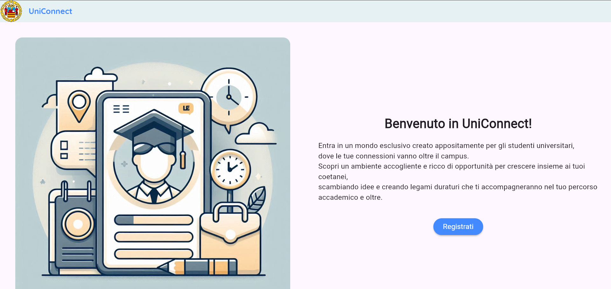                                                |
| Signup             | The Signup page is where new users can register to create an account on the platform. It typically collects basic information such as name, email, and password to set up a new user profile. | 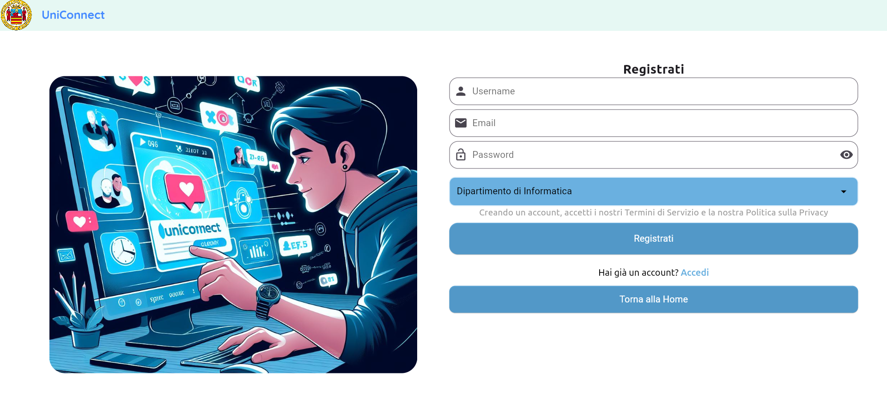                                            |
| Signin             | The Signin page is the entry point for registered users to access their accounts. It prompts users to enter their credentials (username/email and password) to log in securely. | 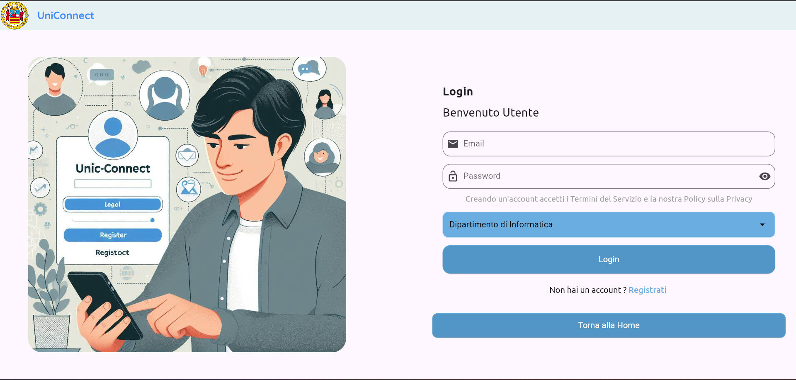                                            |
| HomePageStudent    | The HomePageStudent is the central hub for logged-in students, offering a variety of functionalities tailored to their needs. It may include features like recent activity updates, recommended connections, and quick access to essential tools. | 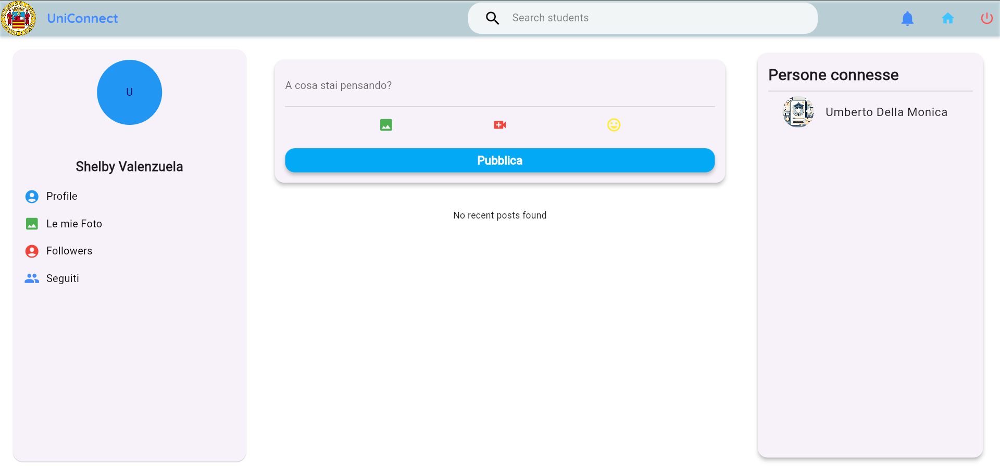                        |
| ProfileStudent     | The ProfileStudent page enables students to view and manage their profile information. Users can edit personal details, upload a profile picture, update their bio, and adjust privacy settings as needed. | 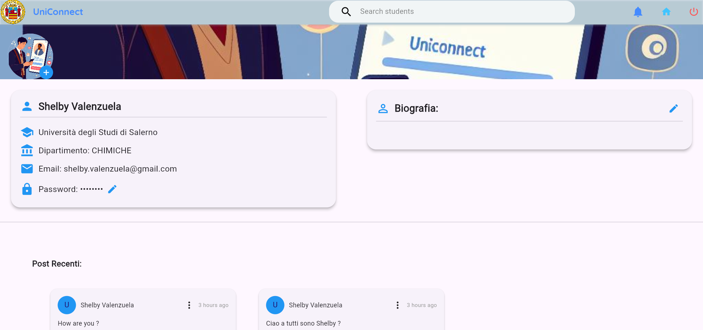                          |
| SearchPageStudent  | The SearchPageStudent allows students to explore and discover other users or content within the app. It typically includes search filters and sorting options to help users find relevant profiles, posts, or resources. | 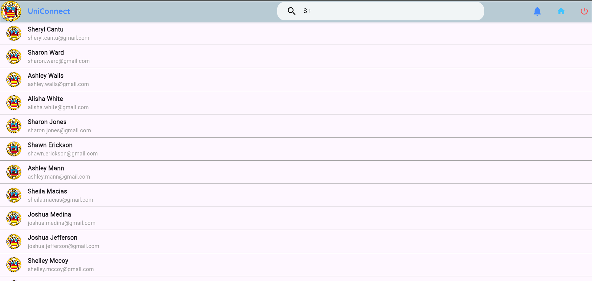                   |
| OtherStudentPage   | The OtherStudentPage displays detailed profiles and activities of other users within the platform, facilitating interaction and networking among students. Users can view interests, connections, recent posts, and more on this page. | 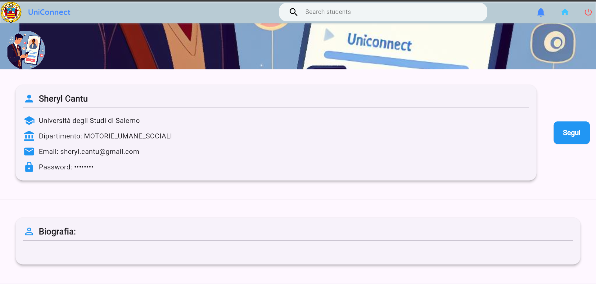                     |

Got it! Here's a table with three images enclosed in one row, each in a separate column:

| Students                                                                                          | Follows-Relationship                                                                                          | Created-by-Relationship                                                                                           |
|--------------------------------------------------------------------------------------------------|--------------------------------------------------------------------------------------------------|--------------------------------------------------------------------------------------------------|
| 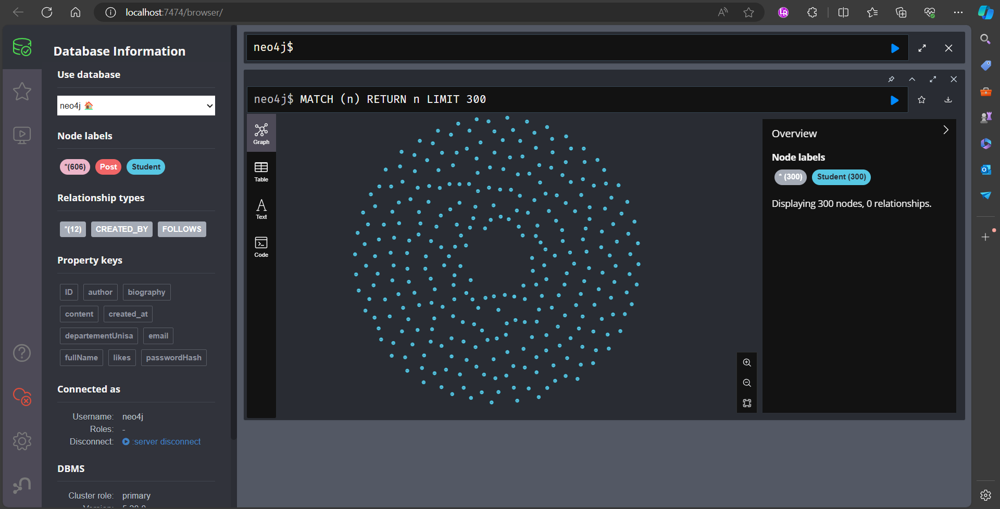                                                      | 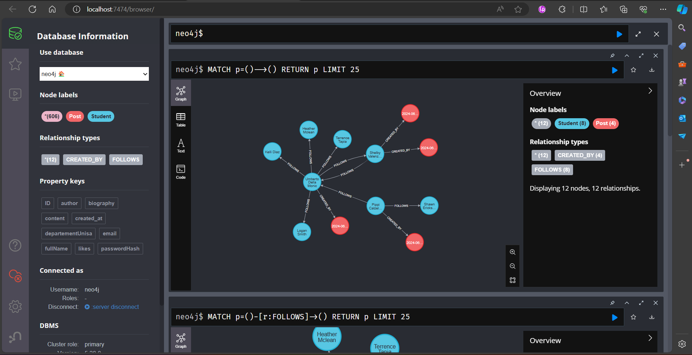                                                    | 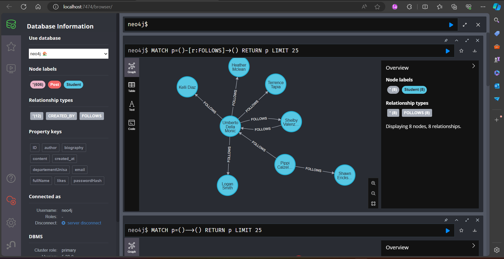                                                    |

This format places each image in its own column within a single row. Let me know if you need further assistance!

## Features : 


UniConnect offers the following primary features:

Absolutely! Let's include multiple images for each feature in the table:

### 1. Registration

| Feature      | Description                                                                                                                                                             | Images                                                                   |
|--------------|-------------------------------------------------------------------------------------------------------------------------------------------------------------------------|-------------------------------------------------------------------------|
| Registration | Registration allows students to create an account on UniConnect. Users provide necessary information such as name, email, and password to gain access to the platform.   |  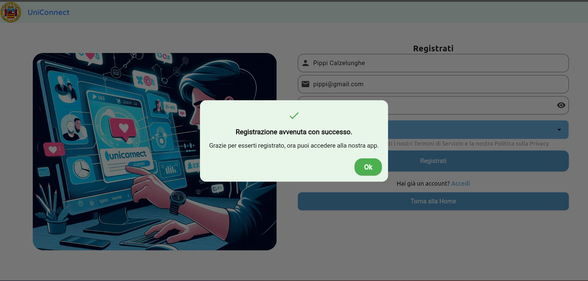                                   |

### 2. Login

| Feature | Description                                                                                                                      | Images                                                        |
|---------|----------------------------------------------------------------------------------------------------------------------------------|--------------------------------------------------------------|
| Login   | Login enables registered students to securely access their accounts by providing their credentials, such as username/email and password. |  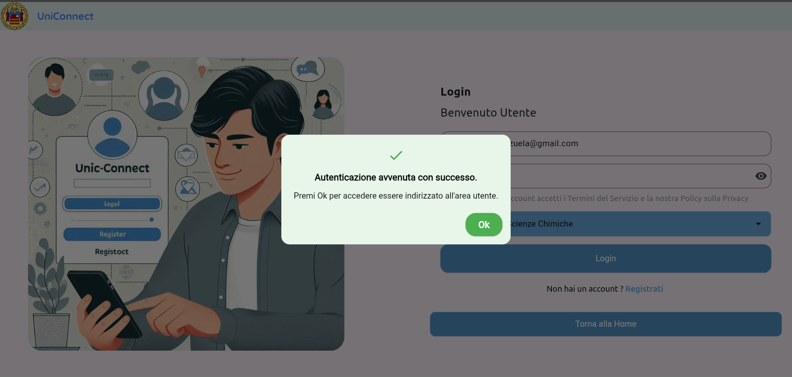                            |

### 3. Profile Update/Deletion

| Feature               | Description                                                                                                                                             | Images                                                                               |
|-----------------------|---------------------------------------------------------------------------------------------------------------------------------------------------------|-------------------------------------------------------------------------------------|
| Profile Update/Deletion | Students have the ability to update or delete their profile information. Users can edit personal details, upload profile pictures, update bios, and adjust privacy settings. | 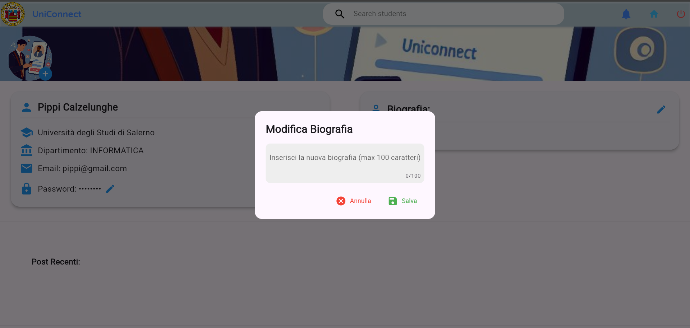 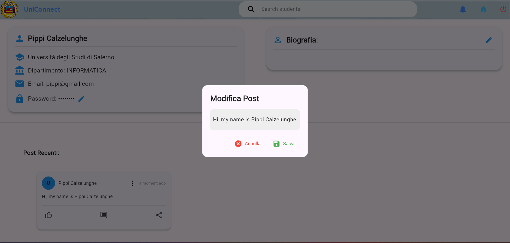                     |

### 4. Student Search

| Feature    | Description                                                                                                                                                                          | Images                                                              |
|------------|--------------------------------------------------------------------------------------------------------------------------------------------------------------------------------------|--------------------------------------------------------------------|
| User Search | User Search functionality allows students to discover and connect with other users. Students can search for profiles or content within the platform to find and engage with relevant users. |                         |

### 5. Follow

| Feature | Description                                                                                                                                     | Images                                                    |
|---------|-------------------------------------------------------------------------------------------------------------------------------------------------|----------------------------------------------------------|
| Follow  | The Follow feature enables students to establish connections with other users. By following their profiles, students can receive updates and engage with their content. | 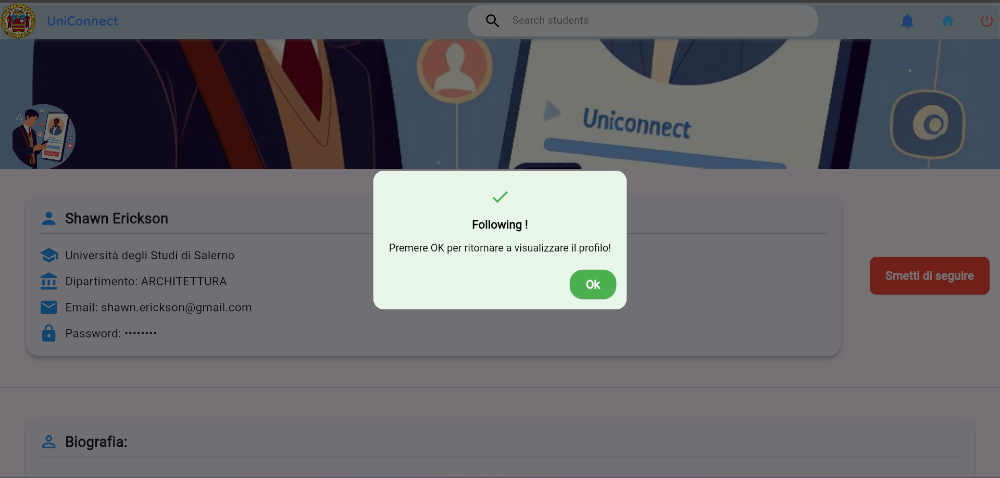 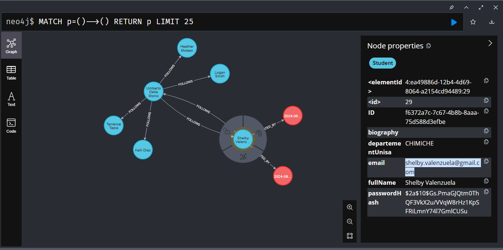                              |

### 6. Post Publishing

| Feature          | Description                                                                                                                                                                                  | Images                                                                 |
|------------------|----------------------------------------------------------------------------------------------------------------------------------------------------------------------------------------------|-----------------------------------------------------------------------|
| Post Publishing | Post Publishing allows students to share their thoughts, ideas, and experiences with others. Students can create and publish posts containing text and images to express themselves on the platform. | 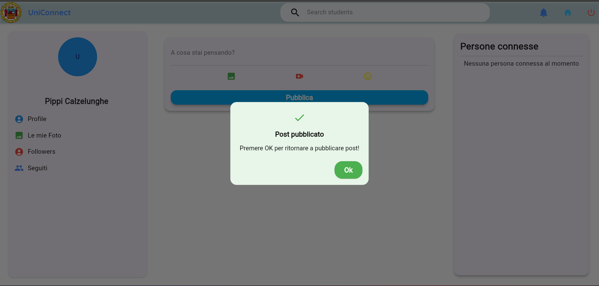                         |

### 7. Post Deletion

| Feature        | Description                                                                                                                                                          | Images                                                                   |
|----------------|----------------------------------------------------------------------------------------------------------------------------------------------------------------------|-------------------------------------------------------------------------|
| Post Deletion | Post Deletion feature grants students the ability to manage their content on the platform. Students can delete their own posts, maintaining control over their published content. | 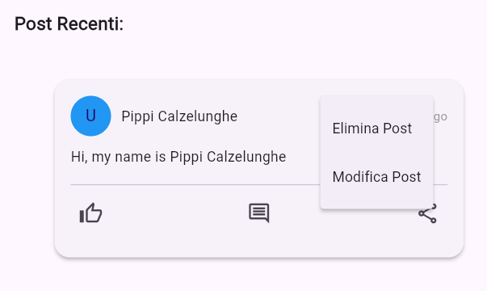 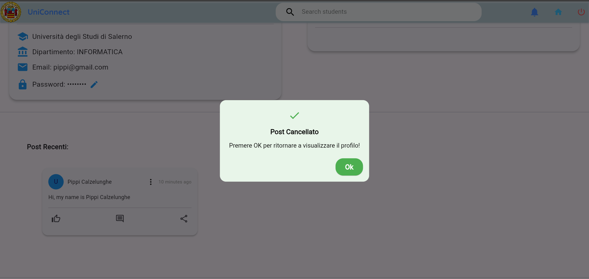                               |


## Conclusion

By following these steps, you will be able to set up and run the UniConnect application

Generate mock data, copy it into the Neo4j Docker container, and import it into the database using Cypher Shell. This `README.md` file contains all the necessary instructions to mock student data, copy it into the Neo4j Docker container, and import it into the database. Be sure to adjust any paths or specific details to fit your development environment.

This `README.md` now includes detailed instructions for running the application directly from the main entry points in Android Studio and IntelliJ IDEA, ensuring users can set up and execute the project efficiently.


